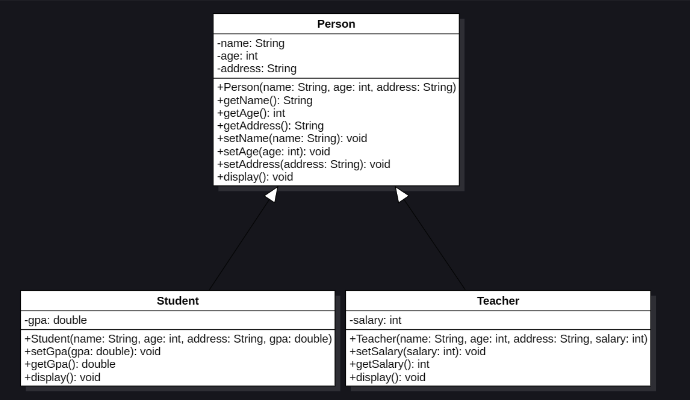

## Bài thực hành

1. Thực hiện kế thừa 02 loại car khác (LuxuryCar and FamilyCar) từ Parent class Car và triển khai logic cho phương thức run() - In ra thông tin loại xe trong phương thức này.
2. Thực hiện phát triển mô hình sau:<br>
 <br>
Trong đó:
   1. name, age, address là các thuộc tính của Person 
   2. Phương thức display được triển khai và in ra thông tin với định dạng như sau
   ```
   Name: Vincent
   Age: 30 
   Address: Ha Noi
   ```
   Với Student và Teacher thực hiện bổ sung thêm thông tin GPA hoặc Salary
Yêu cầu: Tạo ra 2 đối tượng Teacher và Student sau đó in ra thông tin theo phương thức display()

3. Slide:
   1. [Access Modifier](https://drive.google.com/file/d/1uXYLPx8NHWHi61M4ppLUUe27KT_vrLzX/view?usp=sharing)
   2. [Kế thừa](https://drive.google.com/file/d/11OTYbNJgvxRxccJq9eYSX4-iY0p1A6Q1/view?usp=sharing)